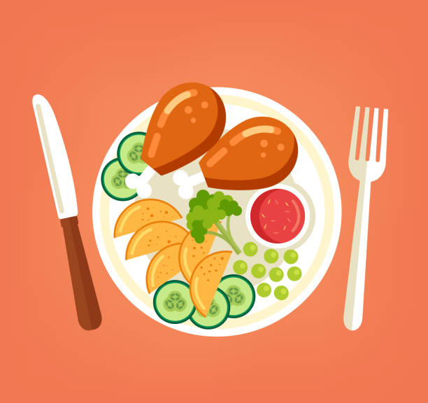

## Overview

Problem: There are so many choices for food around the Mānoa campus, but some of the choices are either not in the budget of students and may or may not be in the taste of some UH students. It might get overwhelming for the bellies of students. 

Solution: This project made for and by UH students because of our overwhelming love for food while also staying in the budget. This website is designed to suit every user’s unique palette, whether it be Hawaiian, Thai, Filipino, Mexican, and so much more. The website will be able to show the user’s current location, but will be defaulted to the location of UH Mānoa. The website will also filter individual restaurants based on the cuisine, the user’s taste, and the price range. We will also determine a popular or trending restaurant of a week.

## Proposers of the project :

- Charles Brown II  
- Kate Hamada  
- Gerric Abe  
- Tyler Jordan Acasio
- Ethan Chiu

## Approach

For our mockup pages, we plan to design some things that support both regular users and admins.

First, we will create a **Landing page** that briefly explains what the site does and who it is for. From here, users can log in, create an account, or browse basic information about the app. After logging in, regular users will be taken to a **User home page**, which will show recommended restaurants based on their saved tastes and budget, as well as a “Popular / Trending Restaurant” section that highlights spots other UH students are visiting and rating highly.

We will also include a **Request a Restaurant** page. If a user does not see a restaurant in the main list, they can fill out a form to request that it be added. This form can include information such as restaurant name, address, type of cuisine, and approximate price range. These requests can later be reviewed and added by an admin.

There will be an **Admin home page** for administrative users. From this page, admins will be able to add new restaurants, edit existing restaurant information (such as address, price range, or cuisine type), and delete restaurants if they close down or are no longer relevant. This separates normal user actions from higher-level data management.

We also plan to implement a **Filter / Search page**. By default, this page will show all restaurants, but users will be able to narrow down the list using several filters:
- Cuisine check boxes (for example: Japanese, Korean, Thai, Hawaiian, etc.)
- A **“Search To My Taste!”** option that only shows cuisines the user has specified on their profile
- Price ranges (for example: $10–$15, $15–$20, etc.)
- An **“I’m Feeling Lucky”** button, similar to the Bowfolios WOD, that shows a random restaurant

Finally, each restaurant will have its own **Individual Restaurant Page**. This page will show details such as:
- Restaurant name  
- Address  
- Type of restaurant and type of food  
- Price range  
- Parking information (with a rating out of 5)  

## Use case ideas 

- New user goes to the landing page; creates an account; edits profile; logs in; gets served the user home page; filters based on price, food type, open hours, location, parking, etc.
- Admin goes to the landing page; logs in; gets served the admin home page; edits restaurants, users

## Beyond the basics 

- Supports local, mom and pop restaurants, new restaurants, etc.
- Gives UH students ideas for food based on their budget and taste
- Uplifts restaurants and gives them more service
- Allows UH students to rate food

  
