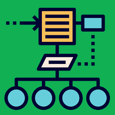

I think of design patterns as the house rules of programming. They do not tell you exactly what to build, they just give you tried and tested ways to arrange your code so it stays stable when the project grows. In more formal terms, design patterns are reusable solutions to common design problems in software. They give names and structure to ideas many developers have discovered on their own, like separating data from the user interface, sharing layouts between pages, or managing one shared resource instead of creating it over and over. Using patterns keeps you from starting from scratch every time and makes it easier for other developers to understand what you were trying to do.

In our RIBows final project, a Next.js app for exploring UH RIOs, those house rules show up in the way we organized the site. One clear example is a layout pattern where we use a shared layout component that wraps every page with the same navbar, footer, and theme tokens. Instead of each page inventing its own header and outer structure, every view plugs into a single shell. We also follow a kind of model and view separation. Prisma schemas and database queries act as the model layer, while React components handle the view. When someone loads the RIO list page, the UI does not deal with SQL directly. It just receives structured data from the model and turns it into cards.

We also lean on patterns for state and access. NextAuth acts like a facade over authentication, so we do not have to hand write login flows, token checks, and session storage. We use a simple API that hides the messy details but gives us a consistent way to check sessions and protect pages. For forms, React Hook Form and shared components give us a repeatable way to handle input. Creating or editing a RIO follows the same rhythm every time. Validate the input, show errors if needed, submit to an API route, then redirect. After working on RIBows, design patterns no longer feel like abstract textbook terms to me. They feel more like quiet guidelines in the background that keep the code predictable, readable, and easier to grow.
