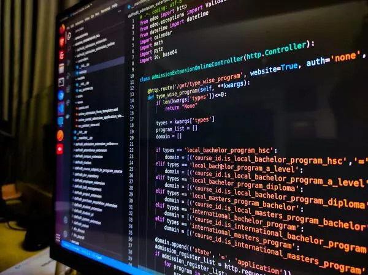

## Introduction

Over this semester, I realized this course was less about “learning React and Next.js” and more about learning how to think like a software engineer. The tools happened to be for web apps, but a lot of what we practiced applies anywhere you’re building software. Three things that stood out to me were Agile / Issue Driven Project Management, configuration management, and design patterns.

## Agile / Issue Driven Project Management

Agile project management is an approach to organizing work that allows you to deliver in small increments, receive feedback, and adjust as needed, rather than attempting to plan everything perfectly early on. In this class, we used Issue Driven Project Management (IDPM). Almost everything we did was related to a GitHub issue, such as fixing a bug, adding a page, or changing the layout. Issues were organized into milestones and linked to pull requests.

At first, this felt like extra work on top of coding, but as the project grew, it became easier. It was clearer who was doing what, which tasks remained open, and what needed to be completed before a milestone. IDPM could be used for projects other than web apps, such as data analysis, research, or even event planning. You could still divide the work into smaller tasks, establish milestones, and track progress in the same way.

## Configuration Management

Configuration management involves monitoring and managing changes to software and its environment. In this class, that primarily meant using Git and GitHub correctly: branches for features, pull requests rather than editing main directly, and commit messages that actually describe the change. It also involved storing tool configurations in the repository (ESLint, Prisma, NextAuth, etc.) to ensure that the entire team’s environment remained consistent.

This applies to any type of software, not just web apps. If you’re writing code for a mobile app or another kind of project, you still need to know which version is up to date, who changed what, and how to roll back if something goes wrong. Without that, debugging and collaboration would still be possible, but more uncertain and slower because you would not be sure where to find and fix something.

## Design Patterns

Design patterns are common ways of organizing code to solve design problems that show up repeatedly. The design pattern that showed up within the structure of the project that we built is the use of layouts, components, and addressing multiple issues. For example, on each page of the project, we used the same layout with the same navbar and footer using the BowFolios template. Also, the user interface components addressed the issue of data presentation, whereas the database handled the relevant data.

However, these concepts are not limited to web development. The important thing is to write code that will be understandable even after some time, when you or someone else comes back to it.

## Conclusion

Overall, this class has made me realize that software engineering is more than what I thought it was at the start of the semester. Working with Agile/IDPM, configuration management, and design patterns showed me how much planning and organization go into creating something that other people can understand, use, and maintain. These are habits I can bring into any future project, whether it is for school, work, or something completely outside of web development.
