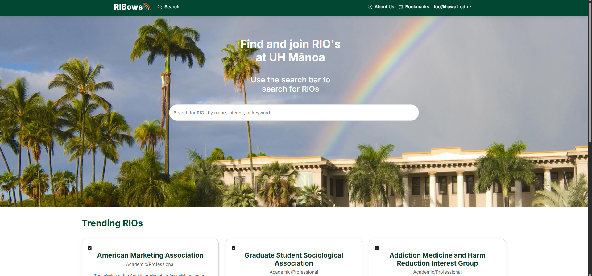
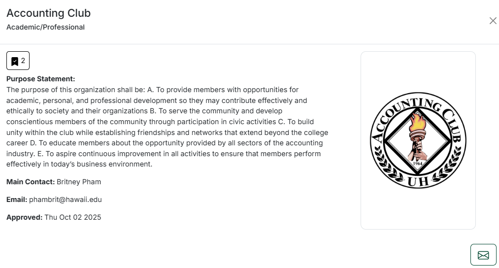

RIBows is a web application that helps UH Mānoa students discover and keep track of Registered Independent Organizations (RIOs). Instead of scrolling through static lists, users can search RIOs by name, interest, or keywords, see results in a card layout, and open a pop-up detail view for each club. Each card shows the club’s purpose statement, main contact, email, and approval date, and logged-in users can bookmark RIOs they are interested in.

The app is built as a full-stack Next.js project with React on the frontend and Prisma + PostgreSQL on the backend. Authentication uses NextAuth, and the UI is styled with React-Bootstrap plus custom CSS variables to match the RIBows color theme. The app also includes an admin interface for editing RIO information and keeping the database up to date.

## My Contributions

I worked across both the frontend and the behavior of the app, especially on search, bookmarks, and UI polish:

- **Landing page search bar and suggestions.**  
  I implemented the landing page search bar that filters RIOs as the user types. It supports searching by name, interest, or purpose statement. The autocomplete dropdown shows matching RIOs, and clicking a result opens a detailed pop-up view with the club’s information.

- **Bookmark system across pages.**  
  I helped wire up bookmark toggling in multiple places: the landing search suggestions, the main search page, and the RIO cards. Each user’s bookmarks are stored in the database, and the UI reflects whether a RIO is bookmarked with an icon that can be clicked to add or remove it. I also worked on making the bookmark count visible in the pop-up so users can see how many people have bookmarked a given club.

- **Sign-in flow debugging and error handling.**  
  I debugged the sign-in behavior so that entering the wrong credentials no longer sends users to a separate dark error page. Instead, the app keeps them on the same sign-in screen and shows an error message. This makes the experience less confusing and keeps the UI consistent with the rest of the site.

- **Edit Add mockup and layout exploration.**  
  I created the mockup and layout for the Add RIO page, focusing on how fields like name, purpose, interests, and image should be arranged so admins can create a new RIO to the system. While I did not implement the full backend logic, this work helped shape the final UI and guided how the add form should look.

- **Styling and consistency fixes.**  
  I spent time cleaning up UI details such as button colors, hover states, and the file upload “Choose File” button. For example, I fixed cases where buttons turned pure white on hover and updated them to use the RIBows green and a lighter green hover state. I also worked on keeping the layout of cards and modals visually consistent across the app. Added the images tp the modal/pop-up card, some of the RIOs can upload an image of their RIO logos or anything that pertains to them but it will only show if there is an image uploaded by the club/RIO.

- **Help Page.**  
  Created a user guide if users were unsure of what to do and what users can do on the app such as look at the trending RIOs currently, explore RIO through the landing page searchbar of the search page with more features to it, and bookmark and email RIOs.

## What I Learned

This project provided me with an actual experience working on an app . I learned how React components, API routes, and databases interact, as well as how minor UI changes frequently necessitate understanding the data flow. Working with search, bookmarks, and the pop-up card for RIO details made me look at state more carefully, including which component "owns" it, when it should update, and how to keep the user interface (UI) in sync with the database.

This project also reinforced some of the software engineering concepts covered in class, such as using GitHub issues and pull requests to organize work, breaking tasks down into smaller pieces, and treating UI polish as an integral part of the product rather than an afterthought. I think RIBows is a great example of a team transforming a shared project into a something that can be useful for UH Mānoa students who want to join with RIOs and engage on campus.

  

  

