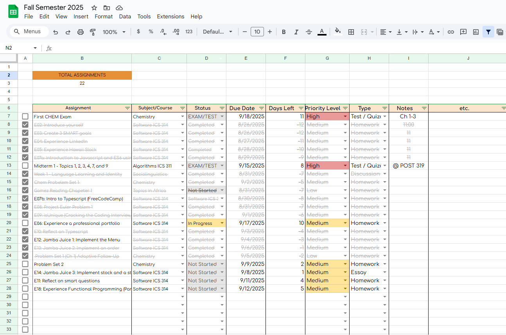

  

In 2024, I was taking classes where many things were due at once. I created this tracker as a way to not lose track of upcoming assignments across different classes. Many existing task management apps felt too complex or cluttered. The tracker makes it easy to input assignments, due dates, statuses, and priorities, and then view everything in a clear, sortable, and filterable way. 

By using some of the functions and cell function liked data validation and conditional formatting, I was able to personalize my spreadsheet to show what type of assignment it is, what date it is due, the priority level, a status of: not started, in progress, and completed, the assignment's subject, and the days left until it's due date.

Using the assignment tracker I created, I was able to be on track with all my assignments. I've done this for about 2/3 semesters for all of my current and past classes, and not once since I've created this have I missed a due date because I knew the date of the assignment/project's deadline.

Here is a [template](https://docs.google.com/spreadsheets/d/1u8wPE-NOCAZwKkRIqgC2tdN8dq6mA-pcFGxB0W2jds0/edit?gid=0#gid=0)

