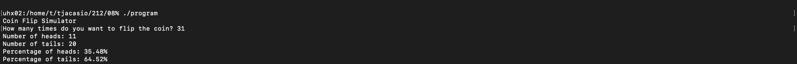

The coin flip simulator was designed to replicate the randomness of a coin flip in a way that was statistically accurate but simple to implement. With the use of C's built-in random number generator, the program utilizes rand() to generate values of either 0 or 1, which are then converted to heads and tails. To ensure that each run of the program produces a distinct sequence of results, the random number generator is seeded with the system using srand(time(NULL)). This replicates the randomness of real coin tosses and prevents duplicate outputs for repeated runs.

The program begins by asking the user to enter the number of times they want the coin flipped, reading input in the getdouble() format and casting it as an integer. Input validation is performed to check that only positive values are allowed, leaving out invalid entries such as zero or negative flips. A loop is then used to perform the simulation, with heads and tails kept apart as each flip is performed. Once the flips are completed, the program calculates the ratio of heads and tails by dividing the counts by the number of flips and by multiplying by 100 to make the result a percentage.

The simulator illustrates many key C programming ideas, including loops, conditionals, input validation, and generating random numbers, through this design.  In order to give a quick sense of the outcome distribution, the output also includes the raw number and the corresponding percentage.

```cpp
/**
 * This program simulates flipping a coin for a user-specified number of times.
 * It calculates and displays the number and percentage of heads and tails.
 *
 * @author Tyler Acasio
 * @date 02/13/2025
 */

#include <stdio.h>
#include <stdlib.h>
#include <time.h>
#include "getdouble.h"  

int main() {
  int numFlips, numHeads = 0, numTails = 0;
  double percentHeads, percentTails;

  // random number generator
  srand(time(NULL));

  // Display program description
  printf("Coin Flip Simulator\n"); // Starting Message
  printf("How many times do you want to flip the coin? "); //Give the user a task
    
  // Get user input and type cast it
  numFlips = (int) getdouble();
    
  // Checks if the user inputs a valid integer
  if (numFlips < 1) {
    printf("Error: Please enter an integer greater than or equal to 1.\n");
    return 1;
  }

  // Simulate coin flips
  int i; // declaring the loop variable before loop because of compiling problems 
    for (i = 0; i < numFlips; i++) {
    if (rand() % 2 == 0) {
	   numHeads++; // Increment heads count if random number is 0
    } else {
   	   numTails++; // Increment tails count if random number is 1
    }
  }

  // Calculate percentages
  percentHeads = 100.0 * numHeads / numFlips;
  percentTails = 100.0 * numTails / numFlips;

  // Display results
  printf("Number of heads: %d\n", numHeads);
  printf("Number of tails: %d\n", numTails);
  printf("Percentage of heads: %.2f%%\n", percentHeads);
  printf("Percentage of tails: %.2f%%\n", percentTails);

  return 0;
}
```
An example output of the program:
<div class="text-center p-4">
  
</div>
