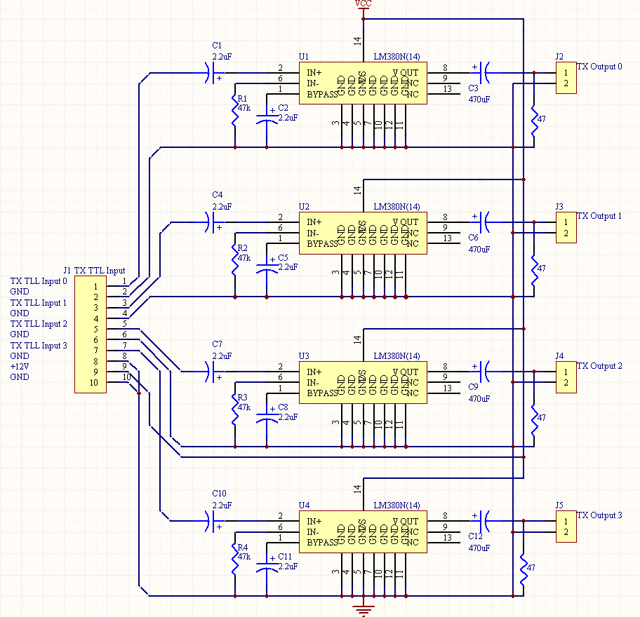

<div class="text-center p-4">
  
  
  
</div>

Micromouse is an event where small robot “mice” solve a 16 x 16 maze.  Events are held worldwide.  The maze is made up of a 16 by 16 gird of cells, each 180 mm square with walls 50 mm high.  The mice are completely autonomous robots that must find their way from a predetermined starting position to the central area of the maze unaided.  The mouse will need to keep track of where it is, discover walls as it explores, map out the maze and detect when it has reached the center.  having reached the center, the mouse will typically perform additional searches of the maze until it has found the most optimal route from the start to the center.  Once the most optimal route has been determined, the mouse will run that route in the shortest possible time.

For this project, I was the lead programmer who was responsible for programming the various capabilities of the mouse.  I started by programming the basics, such as sensor polling and motor actuation using interrupts.  From there, I then programmed the basic PD controls for the motors of the mouse.  The PD control the drive so that the mouse would stay centered while traversing the maze and keep the mouse driving straight.  I also programmed basic algorithms used to solve the maze such as a right wall hugger and a left wall hugger algorithm.  From there I worked on a flood-fill algorithm to help the mouse track where it is in the maze, and to map the route it takes.  We finished with the fastest mouse who finished the maze within our college.

Here is some code that illustrates how we read values from the line sensors:

```cpp
/**
 * This program simulates flipping a coin for a user-specified number of times.
 * It calculates and displays the number and percentage of heads and tails.
 *
 * @author Tyler Acasio
 * @date 02/13/2025
 */

#include <stdio.h>
#include <stdlib.h>
#include <time.h>
#include "getdouble.h"  

int main() {
  int numFlips, numHeads = 0, numTails = 0;
  double percentHeads, percentTails;

  // random number generator
  srand(time(NULL));

  // Display program description
  printf("Coin Flip Simulator\n"); // Starting Message
  printf("How many times do you want to flip the coin? "); //Give the user a task
    
  // Get user input and type cast it
  numFlips = (int) getdouble();
    
  // Checks if the user inputs a valid integer
  if (numFlips < 1) {
    printf("Error: Please enter an integer greater than or equal to 1.\n");
    return 1;
  }

  // Simulate coin flips
  int i; // declaring the loop variable before loop because of compiling problems 
    for (i = 0; i < numFlips; i++) {
    if (rand() % 2 == 0) {
	   numHeads++; // Increment heads count if random number is 0
    } else {
   	   numTails++; // Increment tails count if random number is 1
    }
  }

  // Calculate percentages
  percentHeads = 100.0 * numHeads / numFlips;
  percentTails = 100.0 * numTails / numFlips;

  // Display results
  printf("Number of heads: %d\n", numHeads);
  printf("Number of tails: %d\n", numTails);
  printf("Percentage of heads: %.2f%%\n", percentHeads);
  printf("Percentage of tails: %.2f%%\n", percentTails);

  return 0;
}
```
An example output of the program:
<div class="text-center p-4">
  
</div>
